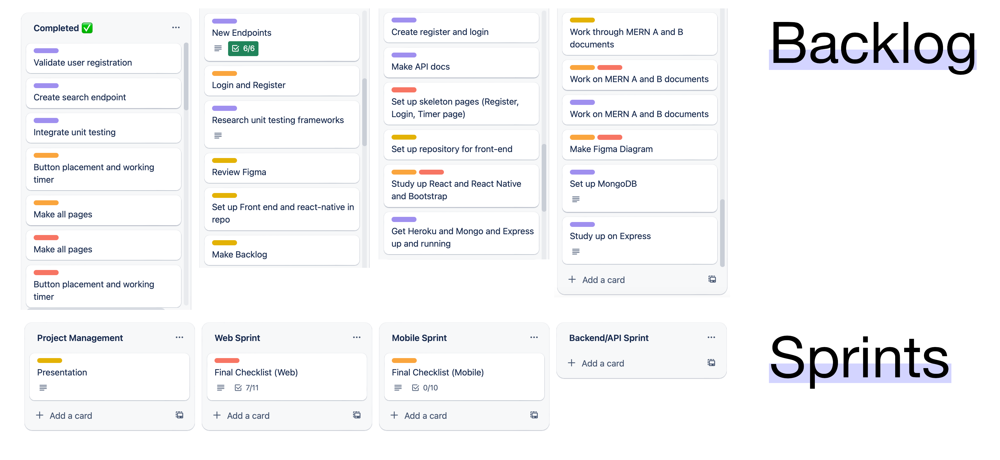
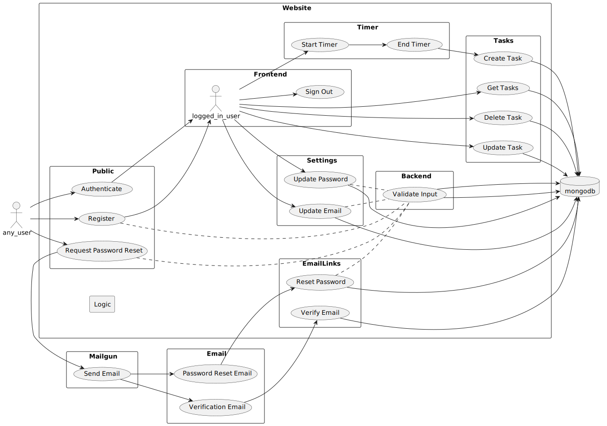
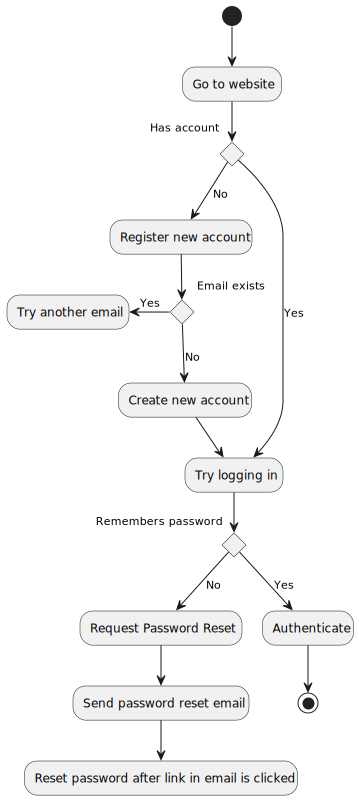
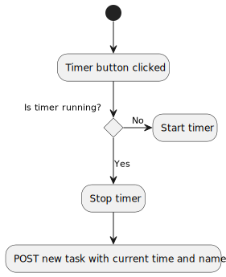
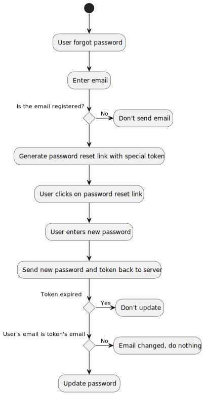
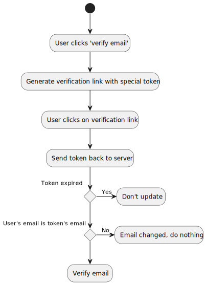
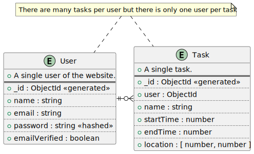

<!-- center -->
<!-- backgroundColor: white -->

# Pocketwatch

#### Your personal time tracker

---

# Team Members

Tyler Angley [@constellationz](https://github.com/constellationz) Project Manager

Khalil Oxborough [@koxborough](https://github.com/koxborough) API & Testing

Christian Lopez [@CLMMS](https://github.com/CLMMS) Website

Ryan Turner [@RyanTurner02](https://github.com/RyanTurner92) Website

Thomas Wallsmith [@twallie](https://github.com/twallie) Mobile App

Pedro Kasprzykowski [@PKTidus](https://github.com/PKTidus) Mobile App

---

# What went well?
 
---
 

# What didn't go so well?
 
---

#### Agile

---

#### Technology used

- MERN Stack (Mongo, Express, React, Node)
- Hosted on Heroku
- Domain from Google Domains
- GitHub for version control
- GitHub Actions to automatically push main branch to Heroku
- Marp for slide deck, PlantUML for diagrams
- SwaggerHub for API documentation
- Postman for API testing
- Trello for organization
- Discord for communication

---

#### Use Case Diagram

---

#### Login Sequence

---

#### Timer Sequence

---

#### Forgot Password Sequence

---

#### Verify Email Sequence

---

#### Entity Relationship Diagram

---

# API Demonstration

[API Demonstration on SwaggerHub](https://app.swaggerhub.com/apis/TANGLEY/Pocketwatch/1.0.0)

---

# Testing Demonstration

[Link to Zoom](https://ucf.zoom.us/my/pkasprzy)

---

# Web Demo

[www.pocketwatch.page](https://www.pocketwatch.page)

---

# Mobile Demo

Doc cam!
[Link to Zoom](https://ucf.zoom.us/my/pkasprzy)

---

# Some links...

Check out our code at
[github.com/constellationz/pocketwatch](https://github.com/constellationz/pocketwatch)

Visit our website at
[www.pocketwatch.page](http://www.pocketwatch.page)

---

# Any questions?